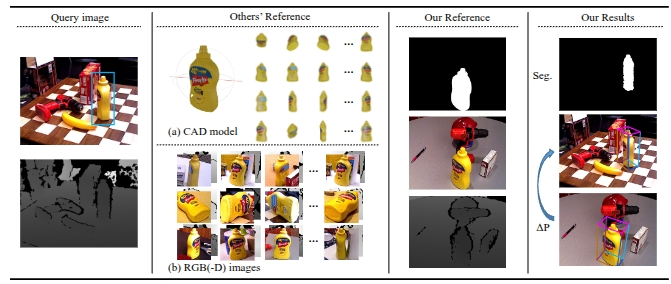
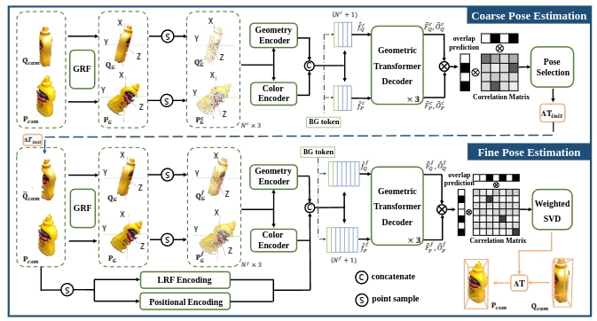

# UNOPose

This repo provides for the implementation of the CVPR'25 paper:

**UNOPose: Unseen Object Pose Estimation with an Unposed RGB-D Reference Image**
[[arXiv](https://arxiv.org/abs/2411.16106)]

NOTE: UNO (/ˈuːnoʊ/) means one in Spanish and Italian.

## Overview
Given a query image presenting a target object unseen during training, we aim to estimate its segmentation and 6DoF pose w.r.t. a reference frame. While previous methods often rely on the CAD model or multiple RGB(-D) images for reference, we merely use one unposed RGB-D reference image.


The network architecture of UNOPose.


## Dependencies

```
conda create --name unopose python=3.10.12
conda activate unopose
pip install torch==2.2.0 torchvision==0.17.0 --index-url https://download.pytorch.org/whl/cu118  # use the correct version of cuda for your system
pip install mmcv==2.2.0 -f https://download.openmmlab.com/mmcv/dist/cu118/torch2.2/index.html # change cuda version if necessary

# Other required packages
pip install -r requirements.txt

# install bop toolkit for evaluation following third_party/bop_toolkit/README.md
cd third_party/bop_toolkit
python setup.py install
cd -

# build pointnet2 extention
cd core/unopose/model/pointnet2/
pip install -e .
cd -
```

## Datasets
Download dataset files from [huggingface](https://huggingface.co/datasets/shanice-l/UNOPose_data/tree/main) or [ModelScope](https://www.modelscope.cn/datasets/wangg12/UNOPose_data/files).
Prepare datasets folder like this:

```
datasets/
├── BOP_DATASETS
    ├──ycbv
        ├──test # download from BOP website
        └──test_ref_targets_crossscene_rot50.json # provided by us
├── segmentation
    └── CustomSamAutomaticMaskGenerator_test_oneref_targets_crossscene_rot50_refvisib_ycbv.json # provided by us
└── MegaPose-Training-Data # Optional, for re-training
    ├──MegaPose-GSO # download from BOP website
        ├── Google_Scanned_Objects # models
        └── train_pbr_web # data
    ├──megapose_gso_fixed_obj_id_to_visib0_8_scene_im_inst_ids.json # provided by us
    ├──megapose_gso_fixed_valid_inst_ids.json # provided by us
    ├──MegaPose-ShapeNetCore # download from BOP website
        ├── shapenetcorev2 # models
        └── train_pbr_web # data
    ├──megapose_shapenetcore_fixed_obj_id_to_visib0_8_scene_im_inst_ids.json # provided by us
    └──megapose_shapenetcore_fixed_valid_inst_ids.json # provided by us
```

## Download Checkpoints
Download DINOv2 checkpoint 'timm_vit_base_patch14_reg4_dinov2_lvd142m.pth' and put it into `checkpoints/`:
```
# export HF_ENDPOINT="https://hf-mirror.com"  # if huggingface.co is not accessible
python core/unopose/scripts/download_and_save_dinov2_ckpt.py
```

Download our trained weight from from [huggingface](https://huggingface.co/shanice-l/UNOPose_model/tree/main) or [ModelScope](https://www.modelscope.cn/models/wangg12/UNOPose_model/files), and put it into <ckpt_path> (e.g. output/).

## Reproduce the results
```
./core/unopose/save_unopose.sh configs/main_cfg.py <gpu_ids> <ckpt_path> (other args)
```

## Training

```
./core/unopose/dp_train_unopose.sh configs/main_cfg.py <gpu_ids> (other args)
```

## Citation
If you find this repo useful in your research, please consider citing:
```
@InProceedings{liu_2025_unopose,
  title     = {{UNOPose}: Unseen Object Pose Estimation with an Unposed RGB-D Reference Image},
  author    = {Liu, Xingyu and Wang, Gu and Zhang, Ruida and Zhang, Chenyangguang and Tombari, Federico and Ji, Xiangyang},
  booktitle = {CVPR},
  month     = {June},
  year      = {2025}
}
```
